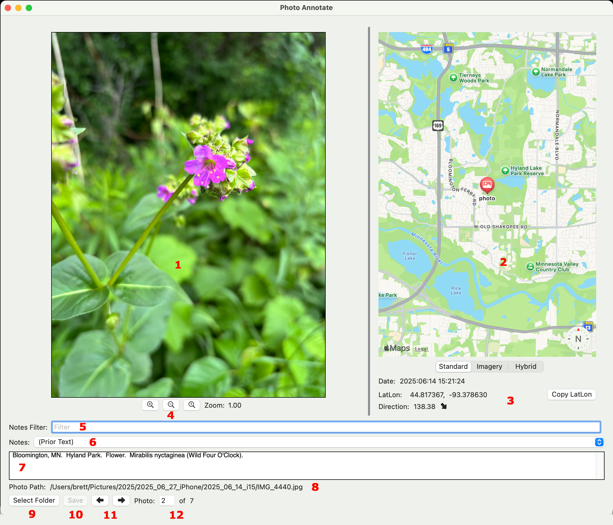

# photo-annotate

Photo Annotate is a macOS app to help annotate photos.  For each supported image
file in a folder it displays the image and allows the user to enter a text
description.  The text description is saved in the same folder with the same
basename as the image but with an extension ".txt".  If the image file supports
GPS location information the image location will be shown on a MapKit map.

## Motivation

Years ago Apple made major changes to the Photos App and I lost a bunch of
existing annotations.  Maybe there were migration assistants that I didn't
discover?  Because I have always disliked Objective-C I didn't want to write my
own migration program.  I wanted a format to backup photos that would be
independent of the OS or a specific App.

When I annotate photos for a trip there is often a lot of repetitive
information.  I wanted to reduce the number of keystrokes when annotating
similar photos.

## Primary Objectives

- The resulting data can be used on any OS.  In that respect it should be
   future proof.
- Previous text within a given session is saved in an ordered list and can be
   easily reused.
- Not modifying the image file.
- Built-in OS text search tools can be used to find specific images.

## Alternative Design Options

I considered using a database to store the photo annotations.  This would
cleanup the image folder by having one database file rather than multiple text
files.  I decided against this for two reasons.  1) Future users or those on
other OS may have problems using a database.  At a minimum there might be some
programming development.  2) OS text searches may not look in a database and, if
it does, another search might be required to find the image file.

I considered putting the text annotations in a subfolder.  This would clean
up image folder of all the text files, but there a slight extra amount of work
to find the image file associated with the text file (it might require a second
search by filename).  At least for macOS Finder searches it is nice to have
the text file with the same base name and in the same folder so, if the Finder
sorts by name, the image and text files are next to each other.

## macOS Project

- Currently supported macOS: 14.7 Sonoma or 15 Sequoia
- Uses: SwiftUI, SplitView, MapKit
- Swift Language Version: Swift 6

## Documentation

Start out by clicking the "Select Folder" button and select a folder containing
images.

Currently recognized image files: JPEG, PNG, HEIC.

1) Image pane.
2) Map pane.
3) Image info.
4) Image zoom controls.
5) Filter text for Notes pulldown.
6) Notes pulldown.  Updated on save text.  Sorted with most recent on top.
7) User editable notes field.
8) Path to current photo.
9) Button to select a new image folder.
10) Save text data after edit.
11) Image "Previous" and "Next" buttons.
12) Index of image in folder.  Images are sorted by name.

## License

This software is covered by the GNU GPLv3 License.

This software uses the SplitView library that is covered by the MIT License
and Copyright by Steven G. Harris.

## Possible enhancements

- Use a mouse scroll wheel to zoom in/out in the image panel.  Apple makes this difficult
when using SwiftUI.  It seemed easier with AppKit.  Note that Apple has implemented this
in the SwiftUI Map View.
